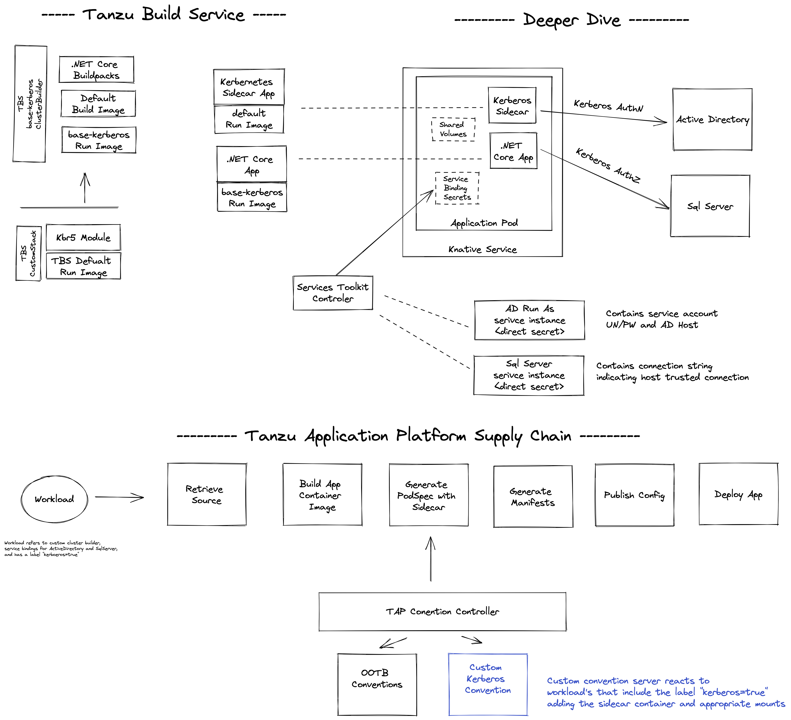

# Tanzu Kerberos

The following repo demonstrates a solution for running .NET Core application on Kubernetes powered by Tanzu Build Service and Tanzu Application Platform.

## Context

Why is this novel and warrant a specific solution?  It is quite common for .NET applications leverage kerberos auth when accessing dependent resources, namely SqlServer.  And this is easly done when the application is running on Windows.  However, to run that application on Kubernetes with linux workers, additional care needs to be taken.  The container base images require [MIT Kerberos](https://web.mit.edu/kerberos/krb5-latest/doc/index.html) modules to be enabled.  And a means needs to be setup to retrieve and refresh Kerberos tickets based upon the desired identity.  Ed Seymour has written a great [blog](https://cloud.redhat.com/blog/kerberos-sidecar-container) describing the problem space and a Sidecar solution to the problem on this topic back in 2018.  A very similar [approach](https://github.com/macsux/kerberos-buildpack) to the same problem was designed by maxsux for cloudfoundry.

## Key Solution Characteristics

- All container images are built using Tanzu Build Service
- The TBS base stack was customized using CustomStack to add the kerberos linux module
- The .NET Core test application uses a solution-project structure
- A Kerberos sidecar container is responsible for retrieving and refreshing kerberos ticket
- A Customized TAP Supply Chain generates a deployment with the kerberos sidecar container

## Guide

The following [guide](guide.md) should be followed for step-by-step instructions to deploy the solution.

## References

This project is heavily inspired through work done by the following...

- [https://github.com/macsux/kerberos-buildpack](https://github.com/macsux/kerberos-buildpack) - Tanzu Application Service solution for the same problem space.
- [Kerberos Sidecar Container](https://cloud.redhat.com/blog/kerberos-sidecar-container) - Blog for implementing kerberos auth on OpenShift.  And associated [github repo](https://github.com/edseymour/kinit-sidecar/blob/master/openshift/example-client-deploy.yaml).
- [Kerberos Test Server](https://github.com/gcavalcante8808/docker-krb5-server) - Referenced in the Kerberos Sidecar Container blog.
